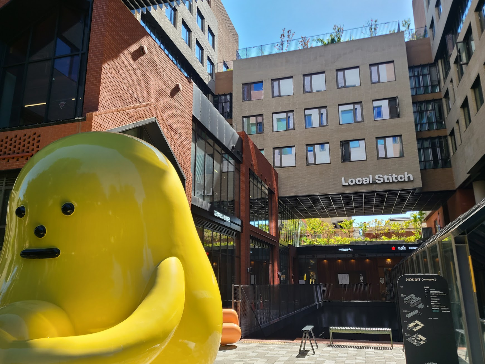

## 문제 1

    Q: 다음 이미지에 대한 설명 중 옳지 않은 것은 무엇입니까?
    1. 사람들이 컴퓨터를 사용하며 앉아 있습니다.
    2. 천장에 조명이 설치되어 있습니다.
    3. "DIVE 2024 IN BUSAN"이라는 문구가 보입니다.
    4. 이미지에는 차가 두 대 보입니다.

    정답: 4. 이미지에는 차가 보이지 않습니다.

----------------

## 문제 2

Q: 다음 이미지에 대한 설명 중 옳지 않은 것은 무엇입니까?
1. 노란색 조형물이 건물 앞에 있습니다.
2. 'Local Stitch'라는 글자가 보입니다.
3. 조형물은 파란색입니다.
4. 배경 건물은 여러 층으로 이루어져 있습니다.

정답: 3. 조형물은 노란색입니다, 파란색이 아닙니다.

----------------

## 문제 3

Q: 다음 이미지에 대한 설명 중 옳지 않은 것은 무엇입니까?
1. 카페 안에 의자와 테이블이 배치되어 있습니다.
2. 카운터 뒤 벽은 노란색으로 칠해져 있습니다.
3. 카운터에는 많은 사람들이 줄 서 있습니다.
4. 넓은 창문을 통해 자연광이 들어오고 있습니다.

정답: 3. 카운터에는 많은 사람들이 줄 서 있는 것이 아닙니다.

----------------

## 문제 4

Q: 다음 이미지에 대한 설명 중 옳지 않은 것은 무엇입니까?

1. 건물의 첫 번째 층에는 커피숍이 있습니다.
2. 건물은 벽돌로 지어져 있습니다.
3. 건물 옥상에는 사람들이 보입니다.
4. 건물 앞에는 주황색 콘이 놓여 있습니다.

정답: 3. 건물 옥상에는 사람들이 보이지 않습니다.

----------------

## 문제 5

---

Q: 다음 이미지에 대한 설명 중 옳지 않은 것은 무엇입니까?
1. 진열대에 다양한 종류의 빵이 놓여 있습니다.
2. 직원들은 흰색 모자를 쓰고 있습니다.
3. 모든 빵에는 가격표가 부착되어 있습니다.
4. 에어컨은 작동 중입니다.

정답: 4. 에어컨은 작동 중인 상태가 아닙니다. (이미지만으로 알 수 없습니다.)

----------------

## 문제 6

Q: 다음 이미지에 대한 설명 중 옳지 않은 것은 무엇입니까?

1. 이미지에는 '뉴트리코어'라는 간판이 보입니다.
2. 사람들이 금속 프레임을 작업하고 있습니다.
3. 황갈색 배너가 설치되어 있습니다.
4. 모든 작업자가 흰색 셔츠를 입고 있습니다.

정답: 4. 모든 작업자가 흰색 셔츠를 입은 것은 아닙니다.

----------------

## 문제 7

Q: 다음 이미지에 대한 설명 중 옳지 않은 것은 무엇입니까?  
1. 여러 사람들이 카페에서 앉아 대화를 나누고 있습니다.  
2. 바닥은 나무로 되어 있습니다.  
3. 모든 테이블이 빈 채로 놓여 있습니다.  
4. 큰 유리창을 통해 자연광이 들어오고 있습니다.  

정답: 3. 모든 테이블이 빈 채로 놓여 있지는 않습니다. 사람들이 앉아 있는 테이블도 있습니다.

----------------

## 문제 8

Q: 다음 이미지에 대한 설명 중 옳지 않은 것은 무엇입니까?

1. 사람들이 버스에 타기 위해 줄을 서 있습니다.
2. 창문에 "COFFEE & BAKERY"라는 글자가 보입니다.
3. 한 사람이 휴대폰을 사용하고 있습니다.
4. 모든 사람들이 검은색 옷을 입고 있습니다.

정답: 4. 모든 사람들이 검은색 옷을 입고 있는 것은 아닙니다.

----------------

